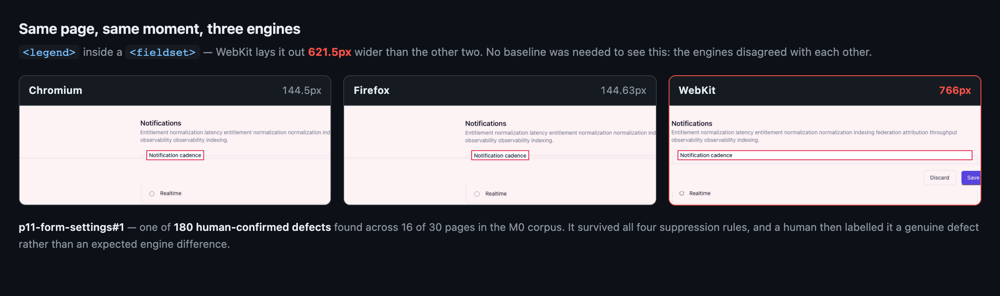

# BrowserParity

**Baseline-free cross-engine UI verification.**

Every visual testing tool compares a browser to its own past self. That needs a baseline,
which means storage, an account, and a golden image you have to approve. On code an agent
generated a minute ago there is no past self to compare against.

BrowserParity compares the same page, at the same moment, across Chromium, Firefox and
WebKit, and treats the engines as each other's oracle. No baselines, no golden images,
no service.

```
npx browser-parity http://localhost:3000
```



One of the 180 defects M0 confirmed by hand: a `<legend>` that WebKit lays out **621.5px**
wider than Chromium and Firefox. Nobody approved a golden image to catch it — the engines
disagreed with each other, which is the whole mechanism.

## Status: M0 passed. Usable, and narrow on purpose.

The first milestone was a measurement with a pre-registered kill condition, and it
returned **GO**: on 30 AI-generated pages, none cherry-picked, **16 pages carried a
human-confirmed genuine defect** — 180 of them — at a median of 4 reviewable findings
per page. The threshold written before the data existed was 3 pages and a median of 5.

```
1,722 raw  ->  475 survivors  ->  180 genuine defects on 16/30 pages
labels: 180 genuine · 295 expected engine difference · 0 unlabelled
```

`npm run verdict` re-derives that from the committed labels; the rule lives in
`m0/scripts/verdict.mjs` and was written before any label existed. The corpus was
frozen and hashed before it was measured, so the base rate cannot be tuned after
the fact.

What exists today is the deterministic core and a CLI over it. The rest of M1 —
exit-code presets, per-rule toggles, `--viewport`, a benchmark corpus — is not built.

The detector is not the hard part; suppression is. On real sites, naive cross-engine
geometry diffing produces unusable noise, and four deterministic rules take it to something
a person can read:

| site | raw findings | after suppression |
|---|---:|---:|
| tailwindcss.com | 638 | 19 |
| react.dev | 611 | 5 |
| playwright.dev | 74 | 0 |

Zero AI calls. Dropping SVG interiors and `display:inline` nodes alone removes 92–98%.
That tolerance model is the project.

## What M0 asked, and what it found

Modern engines have converged. On current Chromium / Firefox / WebKit, nested-flex
`min-width:auto`, grid `minmax(min-content,1fr)`, sticky, viewport units, subgrid,
container-query units and `overflow:clip` all agree to **under 0.5px** once fonts and UA
styles are normalized. So the risk was never false positives. It was that there might be
nothing left to find.

M0 answered that before anything else got built: 30 AI-generated pages, no
cherry-picking, every surviving finding labelled by hand.

| outcome | threshold | result |
|---|---|---|
| **Go** | ≥3 of 30 pages with a genuine defect, median ≤5 survivors | **16 of 30, median 4** |
| Kill | 0 of 30 | not reached |
| Pivot | defects real but all form controls / text metrics | not reached — text-metric 48, layout 43, other 81, form-control 8 |

Where the defects were: **text-metric 48 · layout 43 · other 81 · form-control 8**. Had they
all been the last two rows, this would have become a design-system linter instead.

See **[`m0/README.md`](m0/README.md)** for the corpus, the labels and the run.

## Known ceiling

Playwright's WebKit is not Safari. A finding is credible; the absence of one does not clear
Safari, and iOS is not covered at all. Safari is the main reason people want this, so this
is a permanent limitation rather than a roadmap item.

## The optional AI investigator

The deterministic core never needs a model. On top of it there is an optional
layer that explains *why* a divergence happened — bring your own key; this
project never proxies a model request and never pays for anyone's inference.

How optional it is, is a measurement rather than a claim. A deterministic
known-cause matcher, built from the mechanisms in the labelled corpus, explains
**97.2% of the survivors on a corpus it was never derived from**, with a
mechanism and a fix and no model in the loop. See **[`ai/README.md`](ai/README.md)**
and `node --experimental-strip-types ai/coverage.ts`.

Three models were then run against the same findings to ask whether the layer is
worth switching on at all. None contradicted a rule that was right; two of them
caught rules that were wrong. **[`ai/MODEL-COMPARISON.md`](ai/MODEL-COMPARISON.md)**

`ai/` can be deleted; there is a test that deletes it and runs the core anyway.

## Using it

```sh
npx playwright install            # once — the three engines
npx browser-parity https://example.com
```

```
https://example.com
  274 elements matched in all three engines
  0. raw: any parent-relative or size delta >0.5px   134
  1. + drop SVG-internal nodes                       116
  2. + drop display:inline (text metrics)             48
  3. + tolerance 2px OR 1% of box                     10
  4. + collapse inherited (parent has same delta)      8
  findings                                             8
```

`--json <file>` writes every finding instead of the top ten. `--max <n>` exits 1 when a
page goes over, which is the form you want in CI. `--quiet` prints one line per URL.
Multiple URLs in one run share the three browser launches.

There is no configuration file and nothing is stored between runs. That is the point:
with no baseline there is nothing to approve, drift or check in.

## Research

`RESEARCH.md` · `ARCHITECTURE.md` · `ROADMAP.md` · `docs/research/landscape.md`
