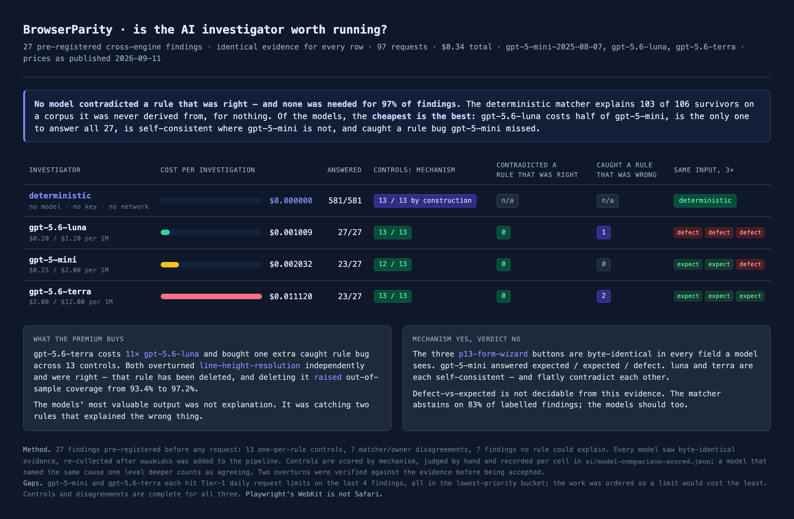

# The AI investigator — optional, BYOK, and mostly unnecessary

The deterministic core is the source of truth and never needs a model. This
directory adds one thing on top of it: an explanation of *why* a divergence
happened. It is optional in the strict sense — `ai/` can be deleted and the core
still builds and runs, and there is a test that proves it by doing exactly that.

**BYOK.** The user brings their own key. This project never proxies a model
request and never pays for anyone's inference. `store: false` is set on every
request, so no copy of the user's page is retained server-side.

**No paid API call has ever been made from this code.** The OpenAI adapter is
written and has not been exercised. Everything that has run is the deterministic
matcher, the mock provider, and the dry run.

---

## The number

The point of this layer is the question *how much of it needs a model at all*.

```sh
node --experimental-strip-types ai/coverage.ts
```

| | survivors | root-cause units |
|---|---:|---:|
| A · 30 hand-authored pages, 475 survivors, all labelled | **100.0%** | 100.0% |
| B · 10 model-emitted pages, 106 survivors, unlabelled | **100.0%** | 100.0% |

Those two figures are **in sample and should not be quoted**. Every rule here was
written while looking at one of these two corpora; a matcher mined from a corpus
explaining all of that corpus is a property of the mining.

The figure that means something is the holdout, which the same command prints:

> **10 rules derived from corpus A, applied to corpus B: 97.2% of survivors
> (103/106) and 91.9% of root-cause units (34/37).**

Corpus B was written by a real coding agent, not by the person who wrote the
rules, and the A-derived rules had never seen it. That is the honest estimate of
what this matcher does on a page it has not met.

**Consequence for the architecture.** A user with no API key gets a mechanism and
a fix for roughly nine findings in ten. The model layer is for the tail, and
"the model is an optional investigator, not a dependency" is a measured claim.

### What the matcher will not do

It explains mechanisms. It mostly refuses to say whether a mechanism is a
*defect*. On the 475 labelled findings the owner marked 90 table-column
divergences genuine and 230 expected — the same mechanism on both sides of the
judgement. So `table-column-distribution` returns `unclear`, and the matcher
abstains on 82% of labelled findings. Where it does commit, it agrees with the
owner's label on **79 of 86** (91.9%).

That abstention is the design. The mechanism is deterministic; whether a 16px
column shift matters on a given page is a judgement about the design, and M0's
rule that verdicts are never auto-approved applies here too.

---

## Which model, if any



Three models on the same 27 findings and byte-identical evidence — see
`MODEL-COMPARISON.md`. None contradicted a rule that was right. Two of them broke
two rules that were *wrong*, one of which has been deleted. If the layer is switched
on, the default is **gpt-5.6-luna**: cheapest of the three at $0.001009 per
investigation, the only one that answered all 27, and self-consistent on identical
inputs where gpt-5-mini is not.

## Layout

```
types.ts         the data shapes. Interfaces only, no runtime code.
evidence.ts      survivors.json (+ the per-page node dump) -> one EvidenceBundle
known-causes.ts  the matcher: 12 rules, ordered, first match wins
provider.ts      the seam: InvestigatorProvider, the tool schemas, the loop
mock.ts          a provider backed by recorded fixtures
openai.ts        the Responses API adapter + dryRun(). Never called.
prompt.ts        request assembly and the strict output schema, shared by both
tokens.ts        token counting (exact via js-tiktoken, or a labelled estimate)
pricing.ts       hand-copied prices and image-token constants, with a date
tools.ts         tool execution against the recorded corpus
render.ts        terminal and Markdown output
cli.ts           investigate
coverage.ts      the measurement above
```

## The evidence bundle

The bundle is the cost budget: every field is a decision to pay for a field on
every investigation. It carries

- the element's structural path, tag, selector, `display` and first 80 chars of text
- the properties that diverged, with all three values
- the box in all three engines, parent-relative and absolute
- the computed styles **filtered to those that bear on the divergent axis** —
  `line-height` cannot explain a width, so it is not sent for one
- the ancestor chain, four deep, with the same style filter
- **descendants carrying the same size delta**, innermost first. A flex column
  that is 15px shorter in WebKit has not made a mistake; the `<select>` four
  levels down has. The funnel drops that select as parent-inherited, so the
  culprit is usually *not* in the findings list and cannot be found by looking
  at sibling findings. It can always be found in the node dump.
- the other survivors on the page, so a symptom can be linked to its cause
- the three element crops, framed identically

It does **not** carry the DOM, the stylesheets, the full-page screenshots, or
the full computed-style blob for every node.

Two filters run before anything is called evidence. WebKit serialises
`font-family` without quotes and Chromium serialises `BlinkMacSystemFont` as
`system-ui`; both appear on nearly every finding in both corpora, and treating
them as signal would poison every explanation. They are classified as
`serialisation` and set aside. Values equal to 2dp but differing in float
representation (`28.8px` vs `28.800001px`) are classified as `precision` and
fed only to the rule that is about exactly that.

## The rules

```sh
node --experimental-strip-types ai/coverage.ts --rules
```

Five mechanisms were confirmed by reading the corpus CSS rather than inferred
from geometry:

| rule | confirmed by |
|---|---|
| `control-font-not-inherited` | `v08-table-users`: `.chip` is a `<button>` setting `font-size` and no `font-family`, while `.btn` and `.pg` both set `font: inherit`. Chromium resolves Arial, Firefox `-apple-system`, WebKit `system-ui`. |
| `font-relative-length` | `v01-landing-saas-hero`: `.lede { max-width: 58ch; margin: 0 auto }` — 691.8px in Chromium, 666.0px in WebKit, and exactly half of that difference appears as `margin-left`. Restricted to elements whose parent is not a flex/grid container: inside one, a narrower box is free-space arithmetic, not a resolved length. |
| `legend-shrink-to-fit` | `p11`, `p12`, `p13`: no author width on the legend; WebKit gives it the fieldset's full 766px. |
| `ua-button-padding` | `p30-nav-app-shell`: buttons styled `py-3` with no horizontal padding; UA `padding-left` is 6px in Chromium/WebKit and 4px in Firefox, and the width difference is exactly twice that. |
| `ua-select-metrics` | `p12-form-checkout`: author `padding: 8px 12px` on a native `<select>`, computed to 0px in WebKit. |

The rest are geometric: `table-column-distribution`, `line-wrap-count`,
`text-shrink-to-fit`, `symptom-absorbed-size`, `symptom-inherited-size`,
`propagated-displacement`, `ua-checkbox-radio-size`.

There was a thirteenth, `line-height-resolution`. Two models overturned it
independently and were right; it explained the wrong thing 14 times and has been
deleted. Deleting it raised out-of-sample coverage. The comment where it used to
live says why, because a deleted wrong rule is worth more as a warning than as a
silence.

## Running it

```sh
# every finding, deterministic matcher only — no key, no network
node --experimental-strip-types ai/cli.ts

# one finding
node --experimental-strip-types ai/cli.ts --finding p12-form-checkout#2

# the whole investigator loop, from fixtures, at zero cost
node --experimental-strip-types ai/cli.ts --provider mock --always --finding p12-form-checkout#2

# a Markdown report
node --experimental-strip-types ai/cli.ts --markdown report.md

# assemble and price a real request, and send nothing
node --experimental-strip-types ai/cli.ts --dry-run --finding p12-form-checkout#2
node --experimental-strip-types ai/cli.ts --dry-run --page p23-table-wide-scroll   # budget across a set

# the tests, including the one that deletes ai/
node --experimental-strip-types --test "ai/test/*.test.ts"
```

`--provider openai` exists and requires `OPENAI_API_KEY`. Without it the CLI
prints what is missing, how to set it, and the fact that the deterministic
output above is already complete — and exits 0.

## What the mock proves

`MockProvider` replays fixture turns through the real loop, and it assembles the
real request on every turn even though nothing is sent. So CI exercises prompt
assembly, image attachment, the tool schemas, multi-turn tool calling, tool
execution against the recorded corpus, the rerun step, structured-output
parsing, and verdict rendering — the expensive path and the free path differ
only in the last hop. A bug in prompt assembly fails in CI rather than on
someone's card.

The fixtures in `fixtures/investigations.json` are **hand-authored stand-ins**,
not captured model output, because this milestone made no API calls. They are
shaped exactly like a Responses API result; when a real run is recorded under an
approved budget it replaces that file and nothing else.

## Cost

Estimated **$0.002314** per investigation on `gpt-5-mini`; measured
**$0.002291** over 27 real investigations — within 1%. That agreement only holds
because the output assumption was recalibrated *after* the step-4 run: the
original estimate assumed 450 output tokens, the real mean was 822 (280 of them
reasoning tokens, billed as output), and it under-priced the run by 52%. See
`STEP4-FINDINGS.md`. Treat the input half of a dry run as firm and the output
half as the soft one.

`--dry-run` counts tokens rather than guessing them. Text is counted with the
real `o200k_base` BPE when `js-tiktoken` resolves (an optional devDependency,
lazily imported, never imported by anything in the core) and with a labelled
structural estimator when it does not — the dry run prints which. Image tokens
come from the published per-model formula, not from the payload size.

Prices are hand-copied constants in `pricing.ts` with a date and a source URL on
them. Re-check them before quoting a figure.

## A step-4 verification run, if the budget is approved

27 findings, chosen so that the result says something either way:

- **7** — the out-of-sample residual: findings the A-derived rules cannot explain
  on corpus B (three `ch`-capped `<p>`s, four accumulated line-height shifts).
  If the model explains these, the tail is real and the layer earns its place.
- **7** — every finding where the matcher committed to a verdict and disagreed
  with the owner's label. Three `ua-button-padding` calls the owner marked
  expected, three `text-shrink-to-fit` calls the owner marked genuine, one
  `symptom-absorbed-size`. If the model sides with the owner, the rules are
  miscalibrated in a knowable way.
- **13** — one high-confidence exemplar per rule, as a control. The question is
  not whether the model can explain them; it is whether it *contradicts* a rule
  that is right, which would be the strongest argument against running it at all.

**This run has happened.** 28 requests, **$0.061851**, one turn per finding —
nothing needed a tool round-trip. Results in `STEP4-FINDINGS.md`, transcripts in
`step4-transcripts/`. In one line: the model named the same mechanism as the rule
on 13 of 13 controls and overturned one rule that was wrong, but it is not
self-consistent about *defect vs expected* on identical inputs, so it is an
explainer and not a judge.

## Known limits

- `flex-direction`, `max-width` and `text-wrap` are not in the pipeline's
  collected computed-style set, so rules that would want them infer from
  geometry instead, and `read_computed_styles` returns `null` for them rather
  than a guess. Widening the collected set is a core change, not an `ai/` change.
- `rerun_engine` needs a browser and is answered offline with the determinism
  the pipeline already recorded (each page was collected twice in Chromium).
- Playwright's WebKit is not Safari. Nothing here may claim otherwise.
